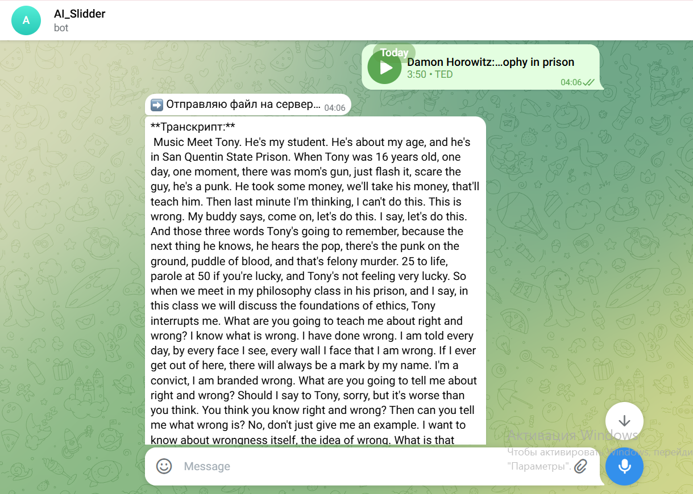
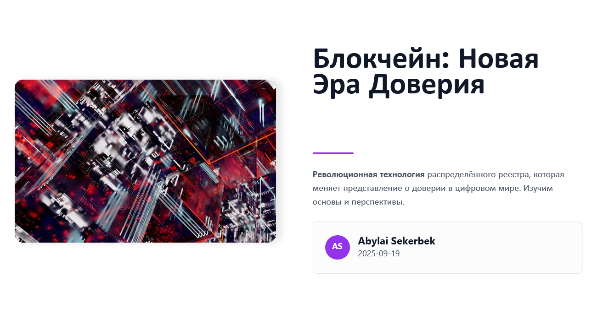
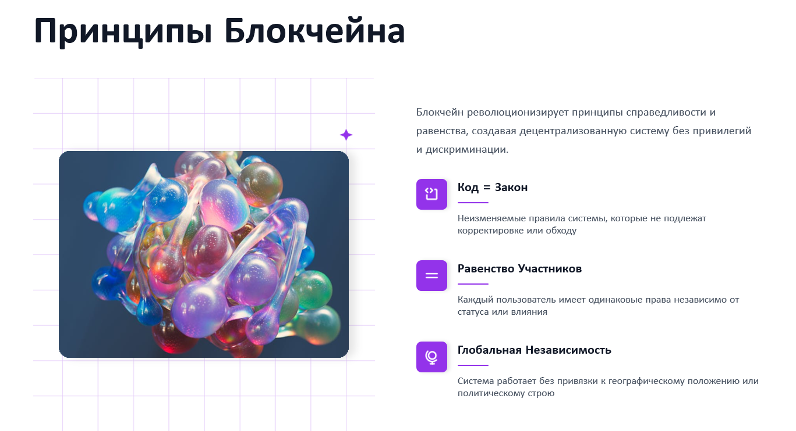
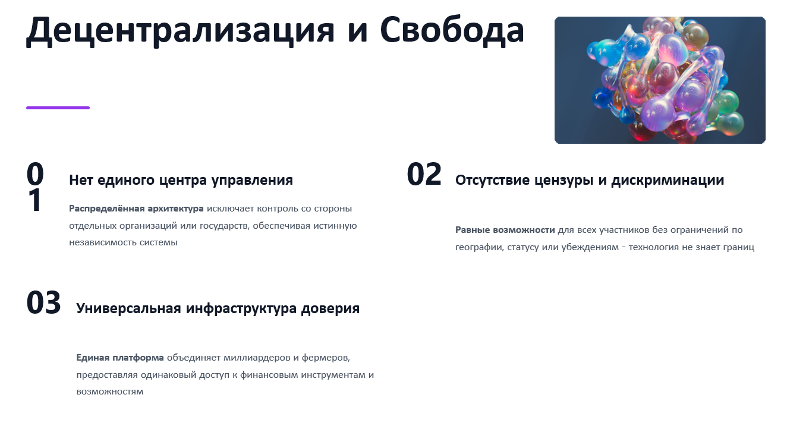

🎥 AI Slidder – AI Interpreter of Creative Content
📌 Description

AI Slidder is an intelligent agent that:

Accepts audio, video, or links from users via a Telegram bot

Performs speech-to-text transcription using Whisper

Generates a summary based on the transcript (supports both Russian and English)

Automatically creates a beautiful PPTX presentation using the transcript and summary via Presenton API or a local generator

⚙️ Tech Stack

Python 3.11

Telegram Bot API

FastAPI
 + ngrok for local hosting

OpenAI Whisper
 (GPU acceleration on Colab/Kaggle/Docker)

Transformers (HuggingFace)
 for text summarization

Presenton API for presentation generation

🚀 Features

Supports audio and video files (mp3, mp4, wav, etc.)

Works with external links (YouTube, Telegram file links, etc.)

Automatic language detection inside the transcript

Ability to choose:

Number of slides

Presentation language

Output includes:

Transcript

Summary

Downloadable PPTX presentation

🖼️ Demonstration
📌 Telegram bot interface:  

📌 Sample presentation slides:  

🔧 Installation & Launch

Clone the repository:

git clone https://github.com/AbylaiSekerbek7/AI_Slidder_Hack_Shai
cd bot

Create a .env file and add your API keys:

TELEGRAM_TOKEN=your_telegram_bot_token
COLAB_API_BASE=your_colab_or_ngrok_url
PRESENTON_API_KEY=your_presenton_api_key

Run the bot:

python bot.py

🏗️ Architecture

Telegram Bot → FastAPI (ngrok) → Whisper (GPU) → Summarizer → Presenton API

📈 Potential & Integrations

Integration with corporate APIs (Zoom, CRM, ERP)

Ability to add next-best-action recommendations

Scalable using Docker and Kubernetes

👨‍💻 Author

Amirlan Sarsenov, Abylaikhan Sekerbek 
